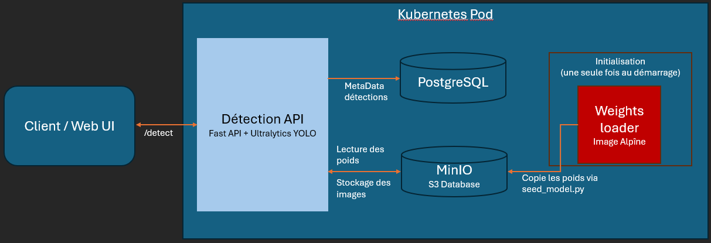

# SENTINEL-VISION — Tactical Intelligence Pipeline

Pipeline d'intelligence tactique basé sur la détection d'objets militaires avec **YOLO** (Ultralytics). L'API d'inférence est déployée sur **Kubernetes** et s'appuie sur **PostgreSQL** (métadonnées des modèles) et **MinIO** (stockage des poids, compatible S3).

Ce projet est une démonstration de déploiement d'IA dans un environnement DevOps orienté fiabilité : chargement idempotent des modèles, health checks, PodDisruptionBudget, et reproductibilité du déploiement sur Windows comme sur Linux.

---

## Sommaire

- [Fonctionnalités](#fonctionnalités)
- [Architecture](#architecture)
- [Prérequis](#prérequis)
- [Structure du projet](#structure-du-projet)
- [Installation initiale de k3s (Linux)](#installation-initiale-de-k3s-linux)
- [Déploiement](#déploiement)
- [Arrêt du service](#arrêt-du-service)
- [Utilisation de l'API](#utilisation-de-lapi)
- [Variables d'environnement](#variables-denvironnement)
- [Performance du modèle](#performance-du-modèle)
- [Points d'attention importants](#points-dattention-importants)
- [Dépannage](#dépannage)
- [Commandes utiles](#commandes-utiles)
- [Crédits](#crédits)

---

## Fonctionnalités

| Fonctionnalité                          | Statut |
|------------------------------------------|:------:|
| Déploiement Kubernetes (k8s / k3s)        | ✅ |
| Déploiement Docker local                  | ✅ |
| Compatible Linux & Windows                | ✅ |
| Interface Web de démonstration            | ✅ |
| API REST documentée (Swagger)             | ✅ |
| Déploiement semi-automatique (scripts)    | ✅ |
| Accélération CUDA                         | ❌ *(non requise pour cette démo, cible CPU)* |
| Accélération ROCm                         | ❌ *(non requise pour cette démo, cible CPU)* |

> L'inférence tourne actuellement en CPU pour simplifier le déploiement de démonstration. L'architecture est prête pour un scheduling GPU : voir [Ressources](#ressources).

---

## Architecture




| Composant           | Rôle                                        | Image / Technologie   |
|----------------------|----------------------------------------------|------------------------|
| **detection-api**    | API d'inférence YOLO + gestion des modèles    | FastAPI + Ultralytics  |
| **weights-loader**   | Image porte-modèle (contient `best.pt`)       | Alpine                 |
| **PostgreSQL**       | Stockage des métadonnées des modèles          | Official `postgres`    |
| **MinIO**            | Stockage objet des poids (S3-compatible)      | Official `minio`       |

Le modèle est chargé une seule fois au démarrage via deux **initContainers** :

1. `copy-weights` : copie le fichier `.pt` depuis l'image `weights-loader` vers un volume partagé (`emptyDir`, monté sur `/shared`).
2. `seed-model` : upload du fichier vers MinIO et enregistrement des métadonnées en base (opération idempotente — un redéploiement ne duplique rien).

---

## Prérequis

| Outil               | Version minimale conseillée | Notes |
|-----------------------|------------------------------|-------|
| Docker Desktop        | 4.x (Windows/Mac)             | Nécessaire pour `deploy.bat` |
| k3s                    | 1.28+ (Linux)                  | Nécessaire pour `deploy.sh` |
| kubectl                | 1.28+                          | Doit pointer vers le bon contexte |
| RAM disponible          | 4 Go minimum, 6-8 Go recommandé | Pour le cluster complet (API + Postgres + MinIO) |

---

## Structure du projet

```bash
.
├── docker_deploy/              # Déploiement Docker local (hors k8s)
├── images/                     # Captures d'écran et schémas (README)
│   └── demo-ui.png
├── k8s_deploy/
│   ├── 0-namespace.yaml
│   ├── 1-secret.yaml           # ⚠️ À modifier avant le premier déploiement
│   ├── 2-postgre.yaml
│   ├── 3-minio.yaml
│   ├── 4-api_configmap.yml
│   ├── 5-api_deployment.yml
│   ├── 6-Ingress.yml
│   ├── 7-pdb.yml
│   ├── Dockerfile              # Image de l'API
│   └── Dockerfile.weights      # Image porte-modèle
├── logs/
├── UI/
│   └── dashboard.html          # Interface web de démonstration
├── weights/
│   └── best.pt                 # Poids du modèle YOLO
├── api.py                      # Point d'entrée FastAPI
├── database.py                 # Connexion PostgreSQL
├── db_models.py                # Modèles ORM
├── inference_service.py        # Logique d'inférence YOLO
├── logging_config.py           # Configuration des logs
├── seed_model.py               # Script d'upload MinIO + enregistrement DB
├── deploy.bat                  # Script de déploiement Windows (Docker Desktop)
├── deploy.sh                   # Script de déploiement Linux (k3s)
├── stop.sh                     # Script d'arrêt / redémarrage / purge (Linux, k3s)
├── requirements.txt
├── .env
└── .gitignore
```

---

## Installation initiale de k3s (Linux)

Étapes à faire **une seule fois**, avant le tout premier `./deploy.sh`, sur une machine Linux qui n'a jamais eu k3s/Docker configurés.

1. **Installer Docker** (utiliser le script officiel, plus fiable que les paquets de distribution) :
   ```bash
   curl -fsSL https://get.docker.com | sh
   sudo usermod -aG docker "$USER"
   ```
   Déconnectez-vous/reconnectez-vous (ou `newgrp docker`) pour que l'appartenance au groupe `docker` prenne effet.

2. **Vérifier/configurer le contexte kubectl.** Si `kubectl config current-context` renvoie `error: current-context is not set`, c'est que le kubeconfig de k3s n'a pas encore été copié à l'emplacement standard :
   ```bash
   sudo test -f /etc/rancher/k3s/k3s.yaml && echo "k3s.yaml trouvé"

   mkdir -p ~/.kube
   sudo cp /etc/rancher/k3s/k3s.yaml ~/.kube/config
   sudo chown "$(id -u):$(id -g)" ~/.kube/config
   chmod 600 ~/.kube/config
   ```

3. **Vérifier** :
   ```bash
   kubectl config current-context   # doit afficher "default"
   ```

4. **Vérifier les outils requis par `deploy.sh`** :
   ```bash
   k3s --version
   docker --version
   kubectl version --client
   openssl version
   python3 --version
   ```

Une fois ces quatre points validés, `./deploy.sh` peut être exécuté normalement (voir [Déploiement](#déploiement)).

---

## Déploiement

### 1. Configurer les secrets (obligatoire)

**Avant le premier déploiement**, éditez le fichier `k8s_deploy/1-secret.yaml` et remplacez toutes les valeurs `change_this_before_deploying`. Voir la table complète dans [Variables d'environnement](#variables-denvironnement).

> ⚠️ Ne committez **jamais** de vrais mots de passe dans le dépôt. Ce fichier est fourni avec des valeurs par défaut non sécurisées, à usage de démonstration uniquement.

### 2. Windows (Docker Desktop)

```bat
deploy.bat
```

Le script :
- build les images `detection-api:local` et `weights-loader:local` ;
- applique tous les manifests Kubernetes ;
- attend que Postgres, MinIO et l'API soient prêts (readiness probes).

**Accès à l'API** (pas d'Ingress par défaut sur Docker Desktop) :

```bat
kubectl port-forward -n sentinel-vision svc/detection-api 8000:80
```

Puis ouvrez [http://localhost:8000/docs](http://localhost:8000/docs).

### 3. Linux (k3s)

Prérequis d'installation ponctuelle : voir [Installation initiale de k3s](#installation-initiale-de-k3s-linux) si ce n'est pas déjà fait sur la machine.

```bash
chmod +x deploy.sh
./deploy.sh

# Rebuild complet des images si besoin :
./deploy.sh --no-cache
```

Sur k3s, l'**Ingress** (Traefik) est appliqué automatiquement. L'API est accessible via le host défini dans `k8s_deploy/6-Ingress.yml`.

> ⚠️ **`deploy.sh` génère un nouveau mot de passe Postgres/MinIO à chaque exécution** (si la génération automatique est choisie). Ne le relancez **jamais** juste pour redémarrer un déploiement existant — utilisez `./stop.sh start` à la place (voir [Arrêt du service](#arrêt-du-service)). Relancer `deploy.sh` sur un cluster déjà initialisé change le secret Kubernetes sans changer le mot de passe déjà enregistré dans le volume Postgres, et casse la connexion de l'API à la base.

### 4. Alternative : Docker Compose (`docker_deploy/`)

Pour un test local rapide ou pour déboguer sans passer par Kubernetes, le dossier `docker_deploy/` fournit une variante Docker Compose du même stack (API + PostgreSQL + MinIO). C'est le mode le plus pratique pour itérer vite : logs directement dans le terminal, redémarrage instantané d'un service, pas de couche d'orchestration k8s à gérer.

```bash
cd docker_deploy
docker compose up --build
```

L'API est alors accessible directement sur [http://localhost:8000/docs](http://localhost:8000/docs) (pas besoin de `port-forward`).

> Cette variante est destinée au développement/débogage local. Le déploiement K8s (`k8s_deploy/`) reste la cible de référence pour la démonstration de l'orchestration et de la résilience (PDB, readiness probes, etc.).

---

## Arrêt du service

Sur Linux/k3s, `stop.sh` gère la mise en pause, le redémarrage et la suppression complète, sans jamais toucher au script `deploy.sh` (donc sans risque de régénérer des mots de passe par erreur).

```bash
chmod +x stop.sh

./stop.sh api        # met en pause uniquement l'API (Postgres/MinIO restent actifs)
./stop.sh all         # met en pause API + Postgres + MinIO (données conservées, réplicas à 0)
./stop.sh start        # redémarre proprement API + Postgres + MinIO dans le bon ordre
./stop.sh destroy      # supprime tout le namespace (⚠️ destructif, confirmation requise)
```

| Commande | Effet | Données | Secrets |
|---|---|---|---|
| `stop.sh api` | API à 0 réplica | conservées | inchangés |
| `stop.sh all` | Tout à 0 réplica | conservées | inchangés |
| `stop.sh start` | Remet tout à 1 réplica, dans l'ordre (Postgres → MinIO → API) | conservées | inchangés |
| `stop.sh destroy` | Supprime le namespace `sentinel-vision` | perdues (sauf PVC en `Retain`) | supprimés |

> **Pour un simple redémarrage, utilisez toujours `./stop.sh start`, jamais `./deploy.sh`.** C'est la règle qui évite le souci de mot de passe désynchronisé décrit plus haut.

Sur Windows (Docker Desktop), il n'existe pas encore d'équivalent de `stop.sh` — utilisez directement `kubectl scale` :

```bat
kubectl scale deployment/detection-api -n sentinel-vision --replicas=0
kubectl scale deployment/minio -n sentinel-vision --replicas=0
kubectl scale statefulset/postgres -n sentinel-vision --replicas=0
```

---

## Utilisation de l'API

| Endpoint         | Méthode | Description             |
|-------------------|---------|--------------------------|
| `/health`          | GET     | Healthcheck              |
| `/docs`            | GET     | Documentation Swagger    |
| `/detect`          | POST    | Inférence YOLO sur une image |

### Exemple de requête

```bash
curl -X 'POST' \
  'http://localhost:8000/predict' \
  -H 'accept: application/json' \
  -H 'Content-Type: multipart/form-data' \
  -F 'file=@example.webp;type=image/webp'
```

### Exemple de réponse

```json
{
  "success": true,
  "detection_id": "string",
  "inference_time_ms": 0,
  "image_width": 0,
  "image_height": 0,
  "num_detections": 0,
  "detections": [
    {
      "class_id": 0,
      "class_name": "string",
      "confidence": 0,
      "bbox": {
        "x1": 0,
        "y1": 0,
        "x2": 0,
        "y2": 0
      }
    }
  ],
  "annotated_image_base64": "string",
  "model_info": {
    "additionalProp1": {}
  }
}
```

Une interface web de démonstration est également disponible dans `./UI` : ouvrez `./UI/dashboard.html` dans votre navigateur.


---

## Variables d'environnement

Définies dans `k8s_deploy/1-secret.yaml`, sous forme de deux `Secret` Kubernetes distincts.

**Secret `postgres-credentials`**

| Variable            | Rôle                                       |
|-----------------------|----------------------------------------------|
| `POSTGRES_DB`          | Nom de la base de données                    |
| `POSTGRES_USER`        | Utilisateur PostgreSQL                       |
| `POSTGRES_PASSWORD`    | Mot de passe PostgreSQL — à changer avant tout déploiement |
| `DATABASE_URL`         | URL de connexion complète (doit rester cohérente avec les 3 valeurs ci-dessus) |

**Secret `minio-credentials`**

| Variable              | Rôle                                       |
|-------------------------|----------------------------------------------|
| `MINIO_ROOT_USER`        | Identifiant admin de la console MinIO         |
| `MINIO_ROOT_PASSWORD`    | Mot de passe admin — à changer avant tout déploiement |
| `MINIO_ACCESS_KEY`       | Clé d'accès S3 utilisée par l'API             |
| `MINIO_SECRET_KEY`       | Clé secrète S3 utilisée par l'API             |

> Le fichier fourni dans le dépôt est un exemple avec des valeurs par défaut (`change_this_before_deploying`). En production, générez ces secrets via `kubectl create secret` en CLI, ou chiffrez-les avec Sealed Secrets / Vault avant de les stocker dans GitLab — ne jamais committer `1-secret.yaml` avec de vraies valeurs.

---

## Performance du modèle

mAP@0.5 par classe, sur le jeu de validation :

| Classe               | mAP@0.5 |
|------------------------|:-------:|
| military_aircraft        | 0.7497 |
| military_tank            | 0.5995 |
| weapon                   | 0.5787 |
| soldier                  | 0.4808 |
| military_truck           | 0.4778 |
| camouflage_soldier       | 0.4734 |
| military_vehicle         | 0.4477 |
| military_artillery       | 0.4368 |
| civilian_vehicle         | 0.3170 |
| civilian                 | 0.0136 |
| trench                   | 0.0000 |
| military_warship         | 0.0000 |

**mAP@0.5 global (moyenne des classes) : ≈ 0.38**

Le modèle est solide sur les classes bien représentées visuellement (aéronefs, chars, armement), mais reste faible sur `civilian`, `trench` et `military_warship` — probablement lié à un déséquilibre ou une insuffisance du jeu d'entraînement sur ces classes. Une piste d'amélioration identifiée : augmenter le nombre d'exemples annotés pour ces trois catégories, ou les retirer du périmètre de détection si non prioritaires.

---

## Points d'attention importants

### Secrets
Le fichier `1-secret.yaml` contient des valeurs par défaut **non sécurisées**. Changez-les systématiquement avant tout déploiement, même en local.

### Mot de passe désynchronisé après un second `deploy.sh`
`deploy.sh` génère un **nouveau** mot de passe Postgres/MinIO à chaque exécution (mode génération auto). Le relancer sur un cluster déjà déployé met à jour le `Secret` Kubernetes mais **pas** le mot de passe déjà initialisé dans le volume Postgres existant → l'API ne peut plus se connecter à la base après redémarrage du pod. Pour un simple redémarrage, toujours utiliser `./stop.sh start` plutôt que `./deploy.sh` (voir [Arrêt du service](#arrêt-du-service)).

### Images locales
Sur Docker Desktop, Kubernetes peut parfois garder en cache une ancienne version de l'image `:local`. Si l'initContainer `copy-weights` échoue avec `No such file or directory`, forcez un rebuild propre :

```bat
docker build --no-cache -f k8s_deploy\Dockerfile.weights -t weights-loader:local .
kubectl -n sentinel-vision delete pod -l app=detection-api
```

### Volume des poids
Le volume `emptyDir` est monté sur `/shared`. **Ne jamais** monter ce volume sur `/weights` : cela masquerait le fichier déjà présent dans l'image `weights-loader`.

### Ressources
L'API est configurée pour tourner en **CPU** (1 replica). Dès qu'un GPU est disponible dans le cluster, le nombre de replicas et le scheduling peuvent être ajustés en conséquence.

---

## Dépannage

| Symptôme                                         | Cause probable                              | Solution |
|----------------------------------------------------|-----------------------------------------------|----------|
| `copy-weights` échoue avec `No such file or directory` | Image `weights-loader` obsolète en cache       | Rebuild `--no-cache` puis supprimer le pod (voir ci-dessus) |
| L'API reste en `CrashLoopBackOff`                  | PostgreSQL/MinIO pas encore prêts au démarrage | Vérifier les readiness probes avec `kubectl describe pod` |
| `port-forward` échoue avec « address already in use » | Port 8000 déjà occupé localement              | Changer le port local : `kubectl port-forward ... 8080:80` |
| Cluster instable / pods en `Pending`                | RAM insuffisante allouée à Docker Desktop     | Augmenter la RAM allouée (Docker Desktop → Settings → Resources) |
| `error: current-context is not set` (Linux)         | kubeconfig k3s pas encore copié dans `~/.kube` | Voir [Installation initiale de k3s](#installation-initiale-de-k3s-linux) |
| API en `CrashLoopBackOff` après un second `./deploy.sh` | Mot de passe régénéré désynchronisé du volume Postgres | Voir [Mot de passe désynchronisé](#mot-de-passe-désynchronisé-après-un-second-deploysh) — utiliser `./stop.sh start` |
| `sed: unknown option to 's'` pendant `./deploy.sh`  | Mot de passe généré/saisi contenant `/`, `#` ou `&` | Corrigé depuis la version courante de `deploy.sh` (échappement systématique) |

---

## Commandes utiles

```bash
# État des pods
kubectl get pods -n sentinel-vision

# Logs de l'API
kubectl -n sentinel-vision logs -l app=detection-api -c detection-api -f

# Logs des initContainers
kubectl -n sentinel-vision logs -l app=detection-api -c copy-weights
kubectl -n sentinel-vision logs -l app=detection-api -c seed-model

# Mettre en pause l'api
kubectl scale deployment/detection-api -n sentinel-vision --replicas=0

#Remettre en route l'API :
kubectl scale deployment/detection-api -n sentinel-vision --replicas=1
```


---

## Crédits

Merci à **ByteMeHarder-404** pour son modèle de référence : [Improved Inference sur Kaggle](https://www.kaggle.com/code/akshatbhalani/improved-inference).