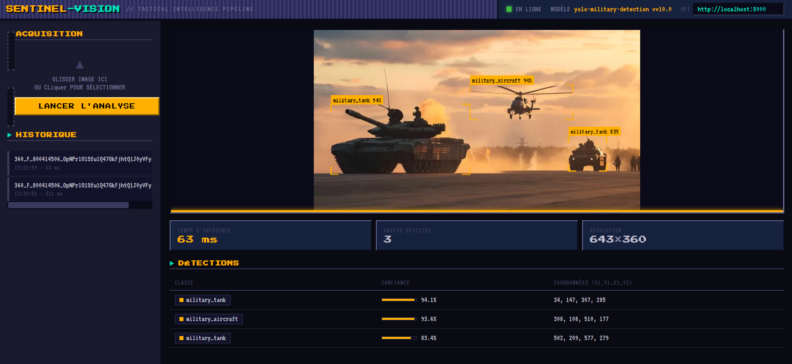

# SENTINEL-VISION — Tactical Intelligence Pipeline

Pipeline d’intelligence tactique basé sur la détection d’objets militaires avec **YOLO** (Ultralytics).  
L’API d’inférence est déployée sur **Kubernetes** et s’appuie sur **PostgreSQL** (métadonnées des modèles) et **MinIO** (stockage des poids).
Ce projet est une démonstration de déploiement d'IA dans un environnement DevOps où la fiabilité est importante. 


---

## Sommaire

## ✨ Fonctionnalités du projet  
* ✅ Déploiement Kubernetes (k8s)
* ✅ Déploiement Docker local
* ✅ Compatible Linux & Windows 
* ✅ Interface Web 16 bits !
* ✅ API Fonctionelle
* ✅ Déploiement semi-automatique
* ❌ Compatibilité Cuda
* ❌ Compatibilité RocM

---

## Architecture

| Composant              | Rôle                                      | Image / Technologie      |
|------------------------|-------------------------------------------|--------------------------|
| **detection-api**      | API d’inférence YOLO + gestion des modèles| FastAPI + Ultralytics    |
| **weights-loader**     | Image porte-modèle (contient `best.pt`)   | Alpine                   |
| **PostgreSQL**         | Stockage des métadonnées des modèles      | Official postgres        |
| **MinIO**              | Stockage objet des poids (S3-compatible)  | Official minio           |

Le modèle est chargé une seule fois au démarrage via des **initContainers** :
1. `copy-weights` : copie le fichier `.pt` depuis l’image `weights-loader` vers un volume partagé
2. `seed-model` : upload vers MinIO + enregistrement en base (idempotent)

---

## Prérequis

- Docker + Docker Desktop (Windows/Mac) **ou** k3s (Linux)
- `kubectl` configuré
- Au moins **4 Go de RAM** disponibles pour le cluster (recommandé 6-8 Go)

---

## Structure du projet

```bash
.
├── deploy.bat                 # Script de déploiement Windows (Docker Desktop)
├── deploy.sh                  # Script de déploiement Linux (k3s)
├── weights/
│   └── best.pt                # Poids du modèle YOLO
├── k8s_deploy/
│   ├── 0-namespace.yaml
│   ├── 1-secret.yaml          # ⚠️ À modifier avant le premier déploiement
│   ├── 2-postgre.yaml
│   ├── 3-minio.yaml
│   ├── 4-api_configmap.yml
│   ├── 5-api_deployment.yml
│   ├── 6-Ingress.yml
│   ├── 7-pdb.yml
│   ├── Dockerfile             # Image de l’API
│   └── Dockerfile.weights     # Image porte-modèle
└── ...
```

---

## Déploiement

### 1. Modifier les secrets (obligatoire)

**Avant le premier déploiement**, éditez le fichier :

```bash
k8s_deploy/1-secret.yaml
```

Remplacez **toutes** les valeurs contenant `change_this_before_deploying` par de vrais mots de passe robustes :

- Mot de passe PostgreSQL
- Identifiants MinIO (`MINIO_ROOT_USER` / `MINIO_ROOT_PASSWORD`)

> ⚠️ Ne committez **jamais** de vrais mots de passe dans le dépôt.

### 2. Windows (Docker Desktop)

```bat
deploy.bat
```

Le script :
- Build les images `detection-api:local` et `weights-loader:local`
- Applique tous les manifests
- Attend que Postgres, MinIO et l’API soient prêts

**Accès à l’API** (pas d’Ingress par défaut) :

```bat
kubectl port-forward -n sentinel-vision svc/detection-api 8000:80
```

Puis ouvrez : [http://localhost:8000/docs](http://localhost:8000/docs)

### 3. Linux (k3s)

```bash
chmod +x deploy.sh
./deploy.sh

# Rebuild complet des images si besoin :
./deploy.sh --no-cache
```

Sur k3s, l’**Ingress** (Traefik) est appliqué automatiquement.  
L’API est accessible via le host défini dans `k8s_deploy/6-Ingress.yml`.

---

## Points d’attention importants

### Secrets
- Le fichier `1-secret.yaml` contient des valeurs par défaut **non sécurisées**.
- Changez-les **systématiquement** avant tout déploiement (même en local).

### Images locales
Sur Docker Desktop, Kubernetes peut parfois garder en cache une ancienne version de l’image `:local`.  
Si l’initContainer `copy-weights` échoue avec `No such file or directory`, forcez un rebuild propre :

```bat
docker build --no-cache -f k8s_deploy\Dockerfile.weights -t weights-loader:local .
kubectl -n sentinel-vision delete pod -l app=detection-api
```

### Volume des poids
Le volume `emptyDir` est monté sur `/shared`.  
**Ne jamais** monter ce volume sur `/weights` (cela masquerait le fichier présent dans l’image `weights-loader`).

### Ressources
L’API est configurée pour tourner en **CPU** (1 replica).  
Dès qu’un GPU est disponible dans le cluster, vous pouvez augmenter le nombre de replicas.

---

## Commandes utiles

```bash
# État des pods
kubectl get pods -n sentinel-vision

# Logs de l’API
kubectl -n sentinel-vision logs -l app=detection-api -c detection-api -f

# Logs des initContainers
kubectl -n sentinel-vision logs -l app=detection-api -c copy-weights
kubectl -n sentinel-vision logs -l app=detection-api -c seed-model

# Supprimer tout le namespace (nettoyage complet)
kubectl delete namespace sentinel-vision
```

---

## Accès à l’API

Une fois déployée :

| Endpoint              | Description                    |
|-----------------------|--------------------------------|
| `GET /health`         | Healthcheck                     |
| `GET /docs`           | Documentation Swagger           |
| `POST /detect`        | Inférence YOLO (image)          |

Vous pouvez également utiliser l'interface web dans /UI. Il suffit d'ouvrir le fichier dans votre navigateur favoris 



---

## Licence
 Merci à ByteMeHarder-404 pour son modèle : https://www.kaggle.com/code/akshatbhalani/improved-inference
[À compléter]
